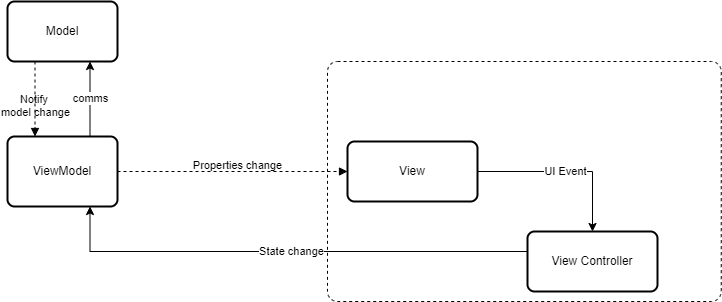

## FE WorkFlow
Sơ đồ hoạt động của Frontend Server:

### Các thành phần cơ bản
- **View:** Tầng View bao gồm 2 thành phần con là View và ViewController:
    - View: bao gồm các giao diện người dùng.
    - ViewController: là lớp trung gian giữa thành phần View và ViewModel. Có nhiệm vụ binding data từ ViewModel lên View và thực hiện command từ View về ViewModel
- **ViewModel:** : Là ánh xạ trực tiếp từ View tương ứng. Có nghĩ là  View  hiển thị những gì thì ViewModel sẽ phải có những state tương ứng như vậy. Bên cạnh đó ViewModel còn gọi tới lớp Model để lấy dữ liệu và thực hiện business logic liên quan tới việc hiển thị trên giao diện người dùng
- **Model:** là lớp giúp giao tiếp với dữ liệu thực sự và thực hiện một sooss business logic.

