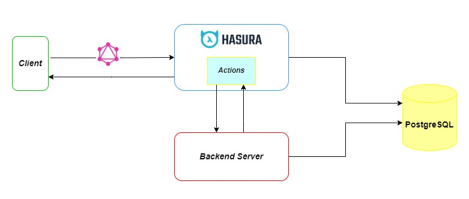

### Hasura workflow
Luồng cơ bản của Hasura GraphQL:



### Query Lấy thông tin từ PostgreSQL
1. Đầu tiên, Client gửi request đến Hasura theo format của graphQL
2. Hasura tiếp nhận request, tự động sinh các câu query tương ứng với ***PostgreSQL*** để lấy dữ liệu theo yêu cầu của người dùng
3. DB thực hiện các câu lệnh query nhận được và trả kết quả về cho Hasura
4. Hasura trả kết quả về cho client

#### Example:
Query lấy các thông tin như id, name, displayAttributes từ DataElementDefinition trong DB: 
```graphql
query MyQuery {
  ias_DataElementDefinition {
    id
    name
    displayAttributes
  }
}
```

### Mutation Query
1. Đầu tiên, Client gửi request đến Hasura theo format của graphQL
2. Hasura tiếp nhận request, chuyển tiếp đến cho Backend Server để thực hiện các business logic(oauth2, validation, ...)
3. Backend Server thực thi các yêu cầu được Hasura chuyển đến và trả kết quả về cho Hasura
4. Hasura trả kết quả về cho client


#### Example:
Câu query insert DataElementDefinition và trả về kết quả thực thi bao gồm id, name và displayAttributes: 
```graphql
mutation MyMutation {
  insert_ias_DataElementDefinition(objects: {name: "Gender"}) {
    returning {
      id
      name
      displayAttributes
    }
  }
}
```


